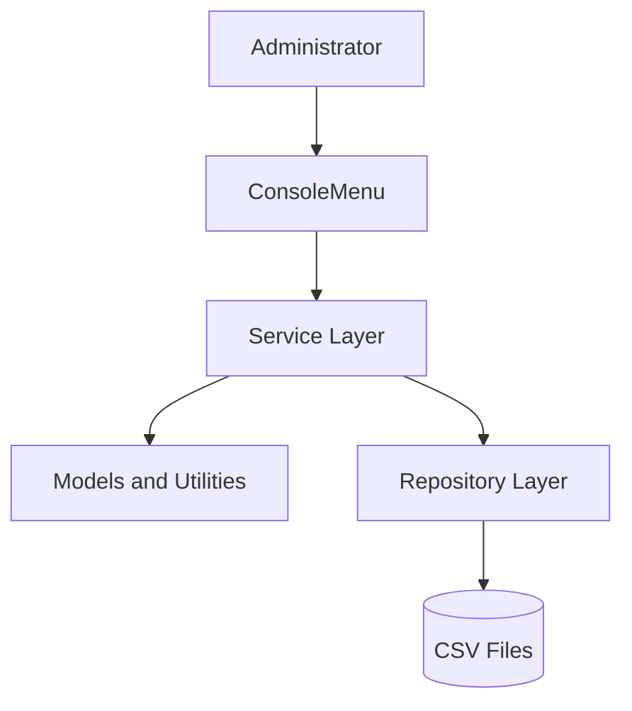
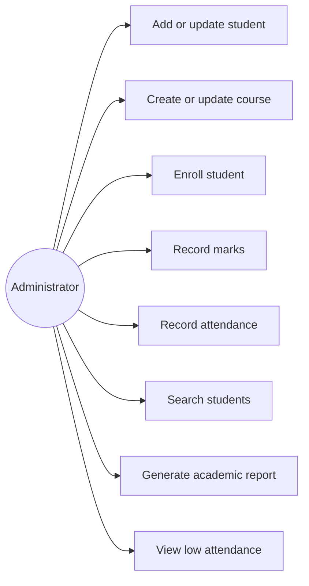
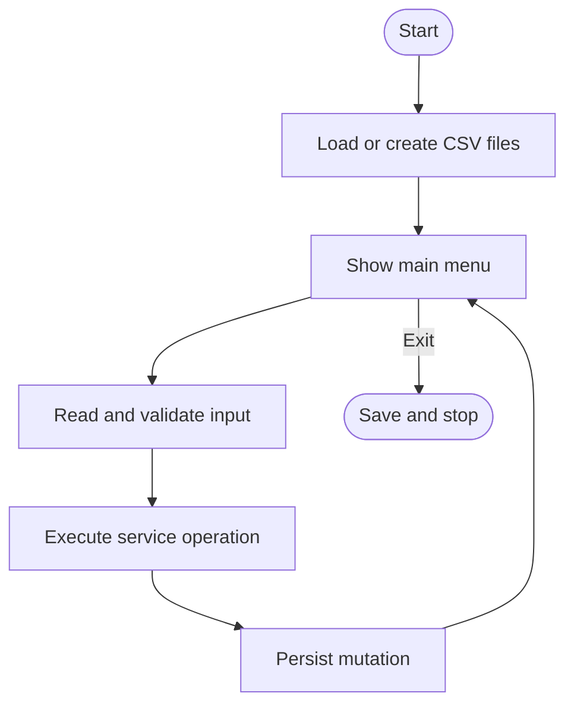
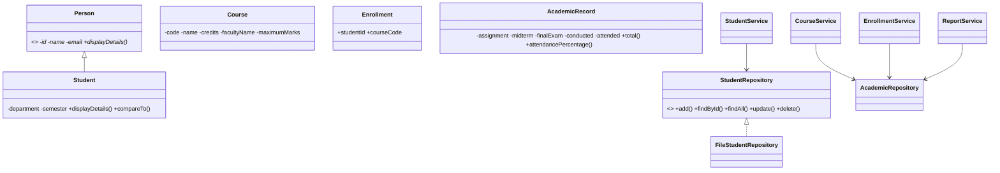
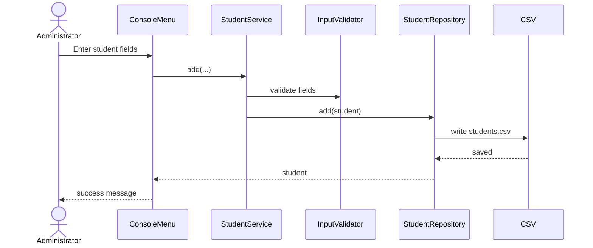
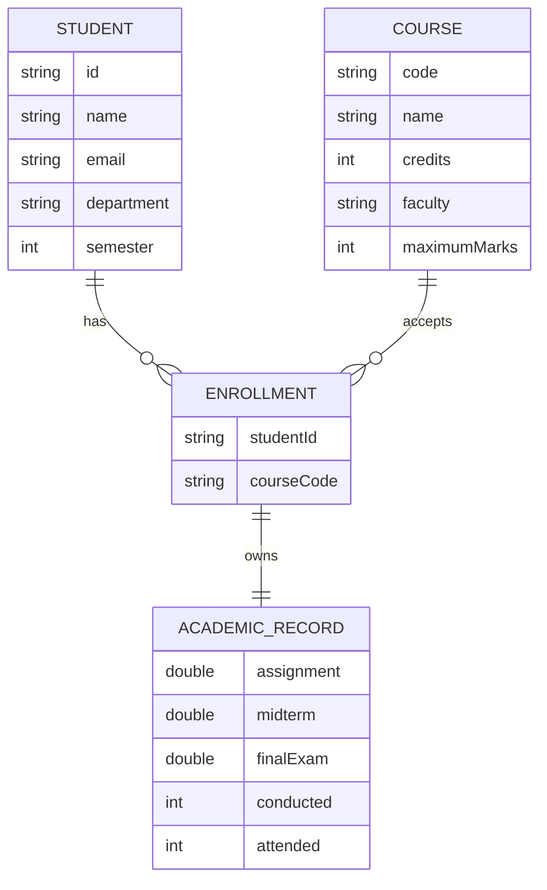

# System Diagrams

## System Architecture Diagram

```mermaid
flowchart TD
  A[Administrator] --> UI[ConsoleMenu]
  UI --> S[Service Layer]
  S --> M[Models and Utilities]
  S --> R[Repository Layer]
  R --> CSV[(CSV Files)]
```

## Use Case Diagram

```mermaid
flowchart LR
  Admin((Administrator)) --> Add[Add or update student]
  Admin --> Course[Create or update course]
  Admin --> Enrol[Enroll student]
  Admin --> Marks[Record marks]
  Admin --> Attendance[Record attendance]
  Admin --> Search[Search students]
  Admin --> Report[Generate academic report]
  Admin --> Low[View low attendance]
```

## Workflow Diagram

```mermaid
flowchart TD
  Start([Start]) --> Load[Load or create CSV files]
  Load --> Menu[Show main menu]
  Menu --> Input[Read and validate input]
  Input --> Service[Execute service operation]
  Service --> Save[Persist mutation]
  Save --> Menu
  Menu -->|Exit| End([Save and stop])
```

## UML Class Diagram

```mermaid
classDiagram
  class Person { <<abstract>> -id -name -email +displayDetails()* }
  class Student { -department -semester +displayDetails() +compareTo() }
  Person <|-- Student
  class Course { -code -name -credits -facultyName -maximumMarks }
  class Enrollment { +studentId +courseCode }
  class AcademicRecord { -assignment -midterm -finalExam -conducted -attended +total() +attendancePercentage() }
  class StudentRepository { <<interface>> +add() +findById() +findAll() +update() +delete() }
  class FileStudentRepository
  StudentRepository <|.. FileStudentRepository
  StudentService --> StudentRepository
  CourseService --> AcademicRepository
  EnrollmentService --> AcademicRepository
  ReportService --> AcademicRepository
```

## Add Student Sequence Diagram

```mermaid
sequenceDiagram
  actor Administrator
  Administrator->>ConsoleMenu: Enter student fields
  ConsoleMenu->>StudentService: add(...)
  StudentService->>InputValidator: validate fields
  StudentService->>StudentRepository: add(student)
  StudentRepository->>CSV: write students.csv
  CSV-->>StudentRepository: saved
  StudentRepository-->>ConsoleMenu: student
  ConsoleMenu-->>Administrator: success message
```

## Storage / Data Relationship Diagram

```mermaid
erDiagram
  STUDENT ||--o{ ENROLLMENT : has
  COURSE ||--o{ ENROLLMENT : accepts
  ENROLLMENT ||--|| ACADEMIC_RECORD : owns
  STUDENT { string id string name string email string department int semester }
  COURSE { string code string name int credits string faculty int maximumMarks }
  ENROLLMENT { string studentId string courseCode }
  ACADEMIC_RECORD { double assignment double midterm double finalExam int conducted int attended }
```
